# Retail Analytics & Customer Intelligence Platform

An **end-to-end retail analytics case study** built on the *Online Retail*
dataset (UCI) — from raw transactional CSV to validated dashboards, customer
segmentation and a **production-ready customer-churn model served through
FastAPI and an interactive Streamlit demo**.

The business question this solves: **who are the valuable customers, why do
they stay, and which customers are most at risk of churning — so a retail
business can target retention where it matters.** Every number on this page is
verified by an automated validation suite that reconciles independent Python,
SQL, Excel and Power BI implementations against each other — not analyzed once,
but cross-checked across four analytical layers.

---

## Contents

| | |
|---|---|
| [Overview & verified results](#overview-and-verified-results) · [Architecture](#architecture) | [Power BI dashboard](#power-bi-dashboard) · [Excel workbook](#excel-analysis) |
| [RFM segmentation](#rfm-customer-segmentation) · [Cohort & retention](#customer-cohort-and-retention-analysis) | [SQL highlights](#advanced-sql-highlights) · [Machine learning](#predictive-analytics-customer-churn) |
| [Streamlit demo](#interactive-churn-prediction-demo) · [Prediction API](#prediction-api) | [Data quality & validation](#data-quality-and-validation) · [Business insights](#key-business-insights) |
| [Quick start](#quick-start) · [Documentation](#documentation) · [Data availability](#data-availability) | [Repository layout](#repository-layout) · [Skills demonstrated](#skills-demonstrated) |

---

## Overview and verified results

| Area | Verified value |
|---|---|
| **Data** | 527,390 cleaned transaction lines (raw: 541,909 rows) |
| **Customers** | 4,339 attributed customers |
| **Revenue** | **£10,619,986.68** |
| **Orders** | 22,064 · AOV **£481.33** |
| **Repeat customers** | 2,845 (**65.57%**) |
| **BI** | 6 Power BI pages · 35 DAX measures |
| **Excel** | 26 analytical sheets incl. RFM |
| **SQL** | 38 business questions in PostgreSQL |
| **Cohorts** | 13 monthly cohorts · M1 retention **22.7%** |
| **ML (W2 holdout)** | ROC-AUC **0.7332** · PR-AUC **0.5945** · recall **79.41%** |
| **High-risk customers** | **1,114 / 2,813** (39.6%) of W2 holdout |
| **Pipeline** | 9-stage automated pipeline with data-quality gate + idempotency |

---

## Architecture

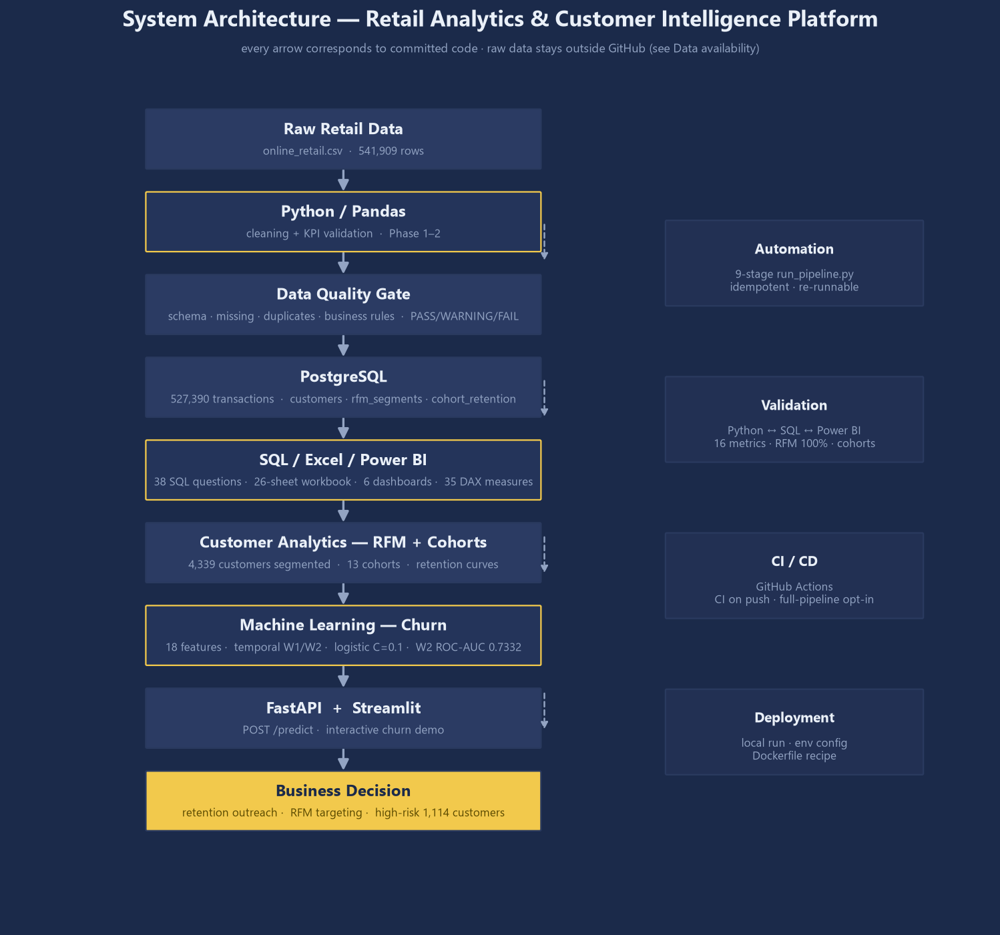

```
Raw Retail Data → Python/Pandas → Data Quality → PostgreSQL
      → SQL / Excel / Power BI → RFM + Cohorts → Machine Learning
      → FastAPI / Streamlit → Business Decision
```

**Tech stack:** Python · Pandas · Excel · PostgreSQL · SQL · Power BI · DAX ·
scikit-learn · FastAPI · Streamlit · GitHub Actions.

---

## Skills demonstrated

| Category | Skills |
|---|---|
| **Analytics** | Python / Pandas · Excel analytics · RFM segmentation · Cohort & retention analysis · business analysis |
| **BI** | Power BI · DAX · star-schema data modeling · report design |
| **Data engineering** | PostgreSQL · advanced SQL (CTEs, window functions, time intelligence) · pipeline automation · data validation · idempotency |
| **Machine learning** | feature engineering · temporal validation · churn prediction · model tuning · interpretability |
| **Production** | FastAPI · Streamlit · GitHub Actions · reproducibility · deployment readiness |

---

## Power BI Dashboard

Six report pages on a star-schema model (`FactSales` + 4 dimensions + 2
standalone cohort tables, 35 DAX measures), generated with **real data** and
reconciled against PostgreSQL (37 automated validation checks, all PASS).
Every page is reproduced as a static preview in `powerbi/previews/` by
`powerbi/scripts/generate_preview.py`.

### 1 · Retail Executive Overview
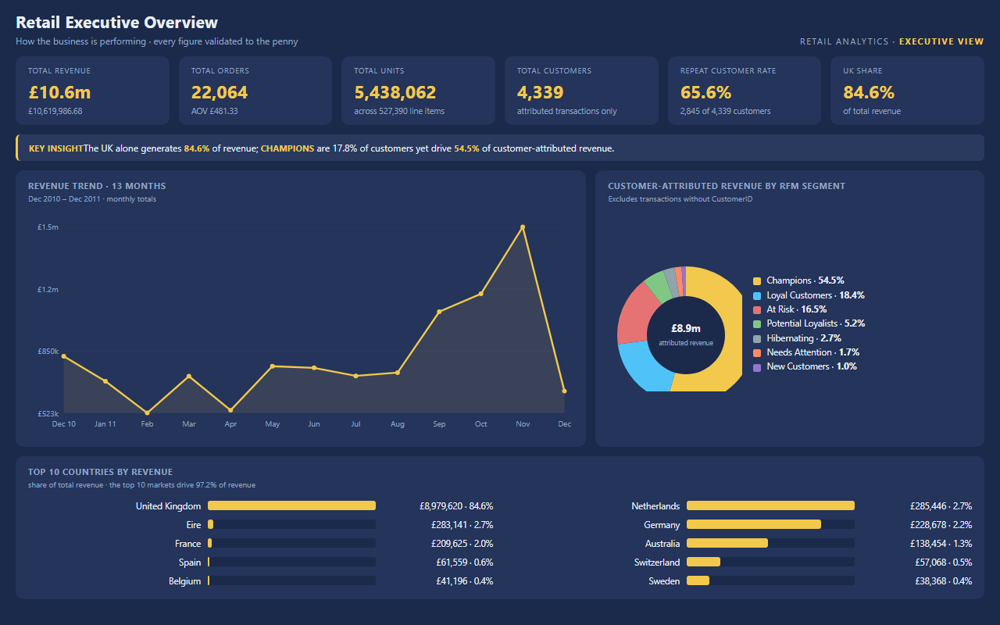
*The 10-second business summary: revenue, orders, units, repeat rate and the
RFM segment mix driving profit (Champions = 17.8% of customers, 54.5% of
customer-attributed revenue).*

### 2 · Sales & Trends
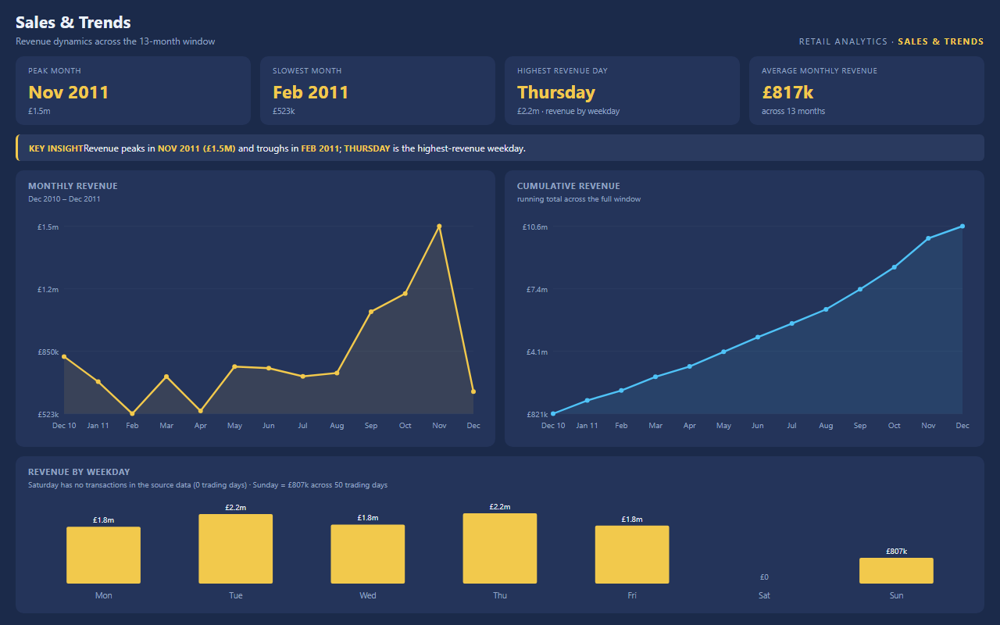
*13-month revenue trend, cumulative growth, weekday patterns and the
November 2011 peak season (Peak month £1.50M).*

### 3 · Customer Intelligence
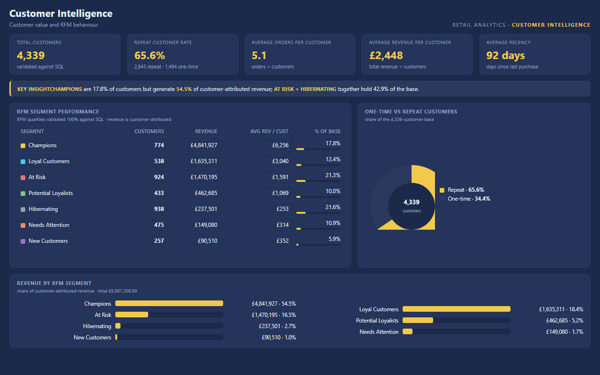
*Customer value, repeat behaviour and RFM segment economics — average revenue
per customer £2,448, average orders per customer 5.1.*

### 4 · Product Performance
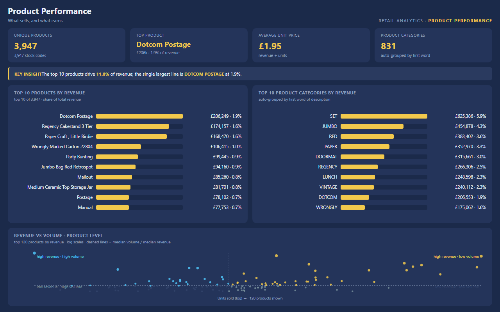
*Top products and categories, plus revenue-vs-volume product archetypes
(niche premium, commodity, long-tail).*

### 5 · Geographic Performance
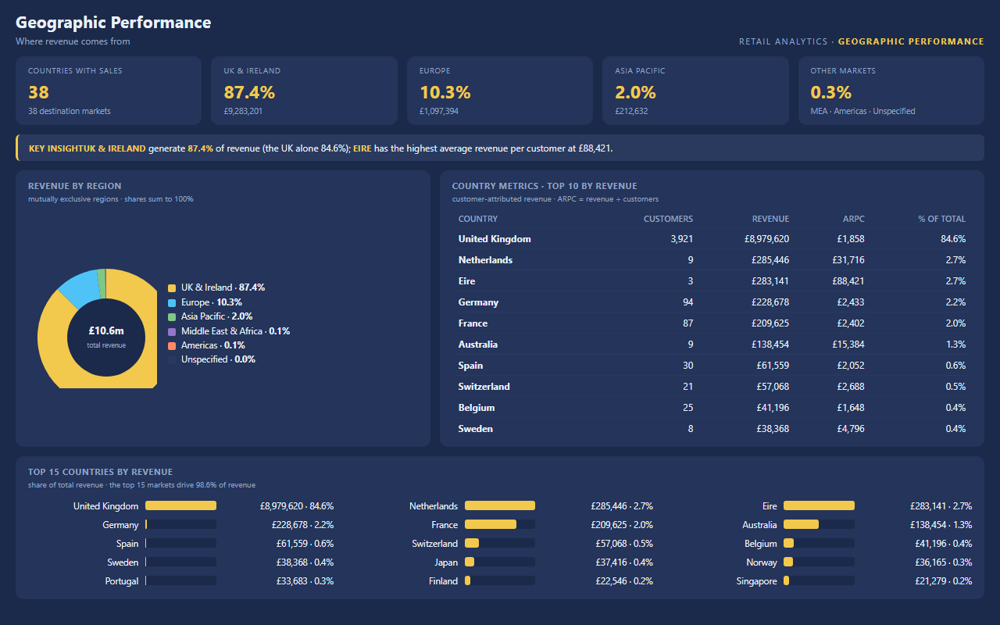
*Revenue by region and country with customer economics — UK & Ireland 87.4%,
38 countries with sales.*

### 6 · Customer Retention (Cohort Analysis)
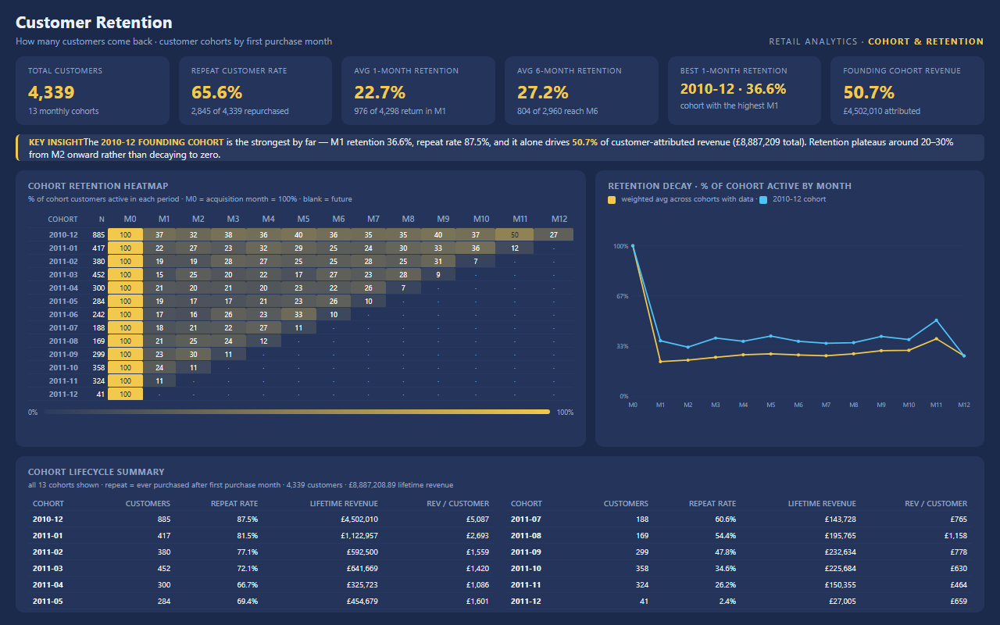
*Cohort retention heatmap and decay curves — retention plateaus at 26–30% from
month 3; the founding Dec-2010 cohort drives 50.7% of cohort revenue.*

---

## Excel Analysis

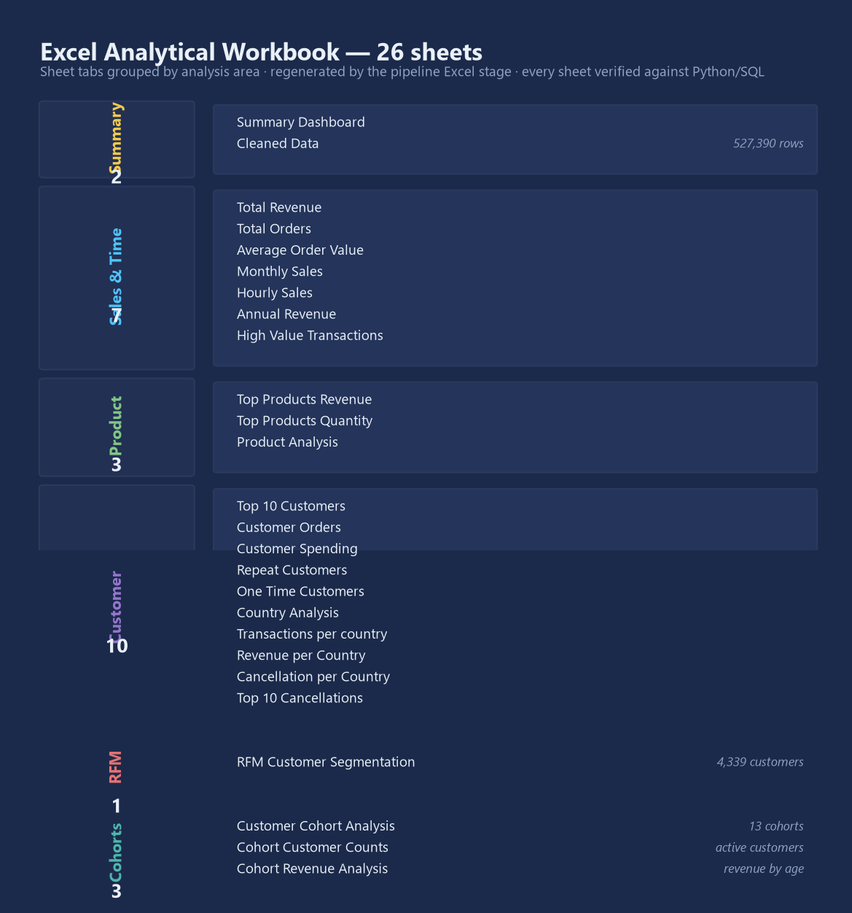

The analytical workbook contains **26 sheets**, including **Summary Dashboard,
Sales, Customer, Product, Time Analysis, RFM Customer Segmentation** and
**cohort-related analysis** (Customer Cohort Analysis, Cohort Customer Counts,
Cohort Revenue Analysis). It is regenerated by the pipeline's Excel stage and
reconciled against the SQL layer. **The full workbook is intentionally kept
outside GitHub; representative screenshots are included here.**

---

## RFM Customer Segmentation

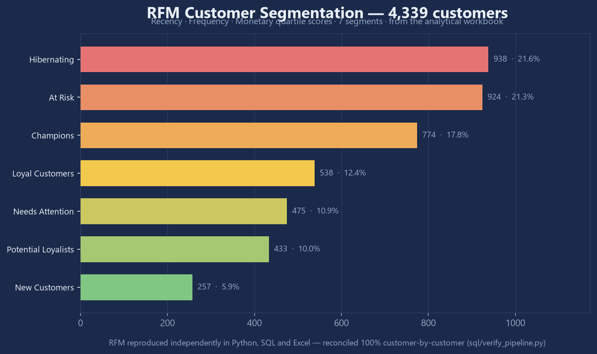

- **Recency · Frequency · Monetary** quartile scoring at **customer level** —
  4,339 attributed customers mapped to 7 actionable segments.
- **100% RFM reconciliation across Python, SQL and Excel** — verified
  customer-by-customer (`sql/verify_pipeline.py`).
- Business use: Champions drive 54.5% of customer-attributed revenue;
  At Risk / Hibernating (43% of customers) are the retention target pool.

---

## Customer Cohort and Retention Analysis

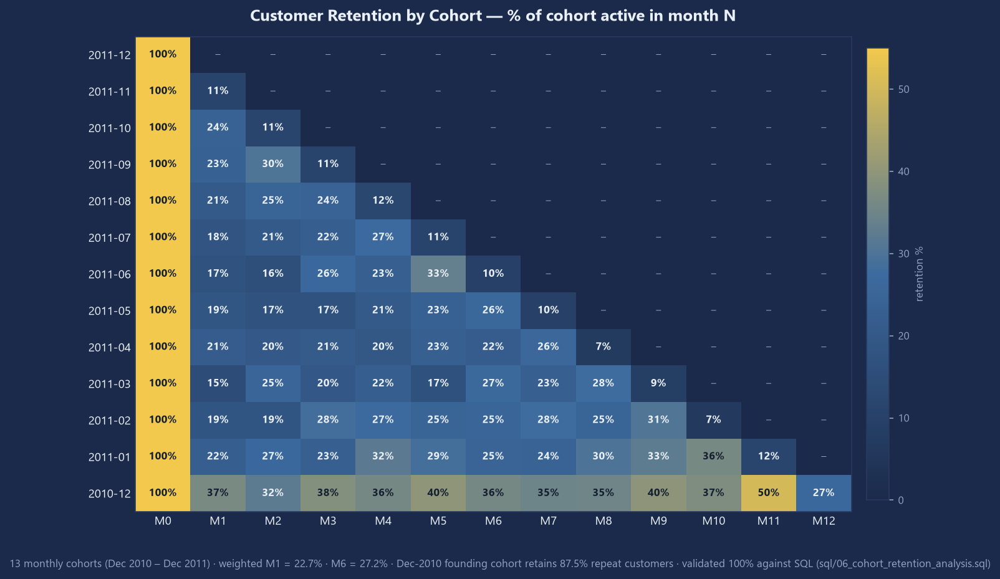

Verified observations:

- **13 monthly cohorts** (Dec 2010 – Dec 2011), M0–M12 retention matrix.
- Weighted **M1 retention = 22.7%**, **6-month retention = 27.2%**; retention
  drops sharply after M0, then **plateaus at 26–30%** from months 3–10 instead
  of decaying to zero.
- The founding **Dec-2010 cohort retains 87.5%** of its customers and generates
  **50.7% of cohort revenue** (£4.50M).
- Cohort validation passed (**12/12 checks**) and the SQL retention tables are
  independently mirrored in pandas (`sql/cohort_validation.py`).

Implemented in `sql/06_cohort_retention_analysis.sql`, imported into Power BI
Page 6, and used as the source for the cohort Excel sheets.

---

## Advanced SQL Highlights

> **38 business questions implemented in PostgreSQL** — see the full
> [`sql/`](sql/) directory (`01_sales_analysis.sql` … `06_cohort_retention_analysis.sql`).

| Technique | What it demonstrates |
|---|---|
| CTEs | multi-step analytical transformations |
| Window functions | ranking / customer behaviour analysis |
| RFM segmentation | customer scoring in SQL (NTILE) |
| Cohort analysis | lifecycle / retention calculations |
| Time intelligence | trend and period-over-period analysis |
| Top-N / ranking | business prioritization (80/20 revenue concentration) |

Generated output: [`sql/insights_report.md`](sql/insights_report.md) —
e.g. 1,130 of 4,339 customers (26%) generate 80% of revenue; the top 10% of
customers hold 61.45%.

---

## Predictive Analytics: Customer Churn

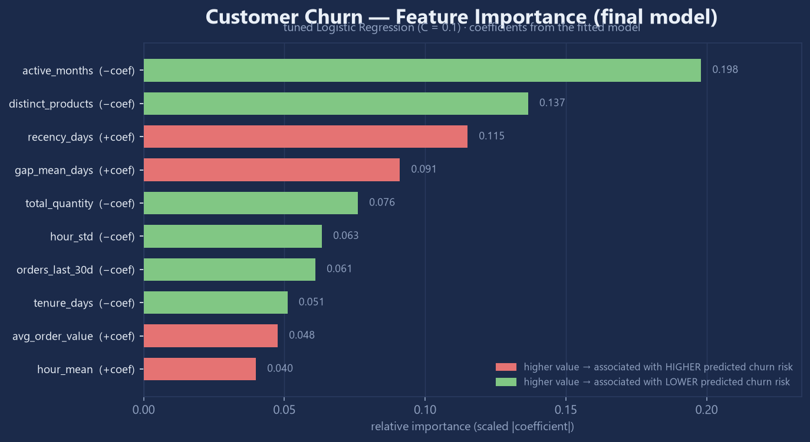
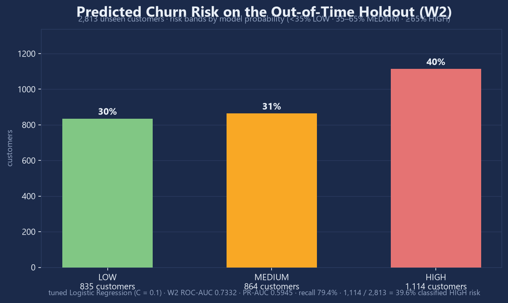

- **18 engineered features** — recency, frequency, monetary, tenure, product
  breadth, purchase timing and gaps, built on the SQL-validated customer table.
- **Temporal validation with no leakage**: features from each window's
  observation period, labels from the strictly-later label period. **W1**
  (2,718 customers) is used for training/tuning; **W2** (2,813 customers) is a
  genuine **out-of-time holdout** never touched during fitting or tuning.
- **Final model: tuned Logistic Regression (C = 0.1)** — W2 **ROC-AUC 0.7332**,
  **PR-AUC 0.5945**, **recall 0.7941**, identifying **1,114 / 2,813 (39.6%)**
  W2 customers as high-risk.
- Interpretability: coefficient-based feature importance
  (`reports/ml_feature_importance.csv`). Lower activity, narrower product
  breadth and longer purchase gaps are **associated with higher predicted
  churn risk** — association, not causation.

---

## Interactive Churn Prediction Demo

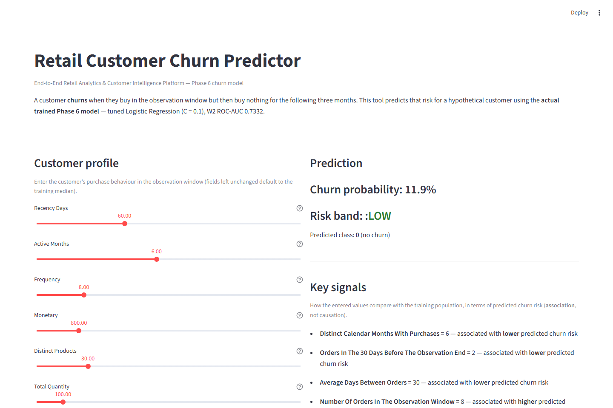

The demo (`streamlit run app/churn_demo.py`) scores a customer profile with the
**actual tuned Phase 6 model**:

- customer inputs (recency, frequency, monetary, product breadth, gaps …)
- **churn probability** and **risk band** (LOW / MEDIUM / HIGH)
- **key predictive signals** — how the entered values move predicted risk
- a recommended business interpretation for each band

No public deployment is hosted; run it locally after exporting the model
(`python pipeline/model_export.py`).

---

## Prediction API

`uvicorn api.main:app` — thin FastAPI service over the same exported model
(no database access, no credentials).

```
GET  /health     → {"status": "ok", "model": "ready"}
GET  /model      → final model, hyperparameters, W1/W2 windows, W2 metrics
POST /predict    → {"churn_probability", "risk_band", "prediction"}
```

Example (real output from the exported model):

```bash
curl -X POST http://localhost:8000/predict \
  -H "Content-Type: application/json" \
  -d '{"features": {"recency_days": 90, "active_months": 3, "frequency": 4,
        "monetary": 300, "distinct_products": 8, "total_quantity": 40,
        "gap_mean_days": 40, "orders_last_30d": 1}}'
```

```json
{"churn_probability": 0.4612, "risk_band": "MEDIUM", "prediction": 0}
```

The chain is **model → API → usable prediction service**: the same artifact
powers the Streamlit demo and the API.

---

## Data Quality and Validation

The project is validated across independent analytical layers, not analyzed
once:

| Layer | Validation | Status |
|---|---|---|
| Data-quality gate | schema, missing values, duplicates, dates, business rules | PASS (deliberate warnings documented) |
| Python ↔ PostgreSQL | **16 core reconciliation metrics** (9 KPIs + 7 RFM segments) | PASS |
| RFM | Python vs SQL vs Excel, customer-by-customer | **100% agreement** |
| Cohorts | SQL vs independent pandas implementation | **12/12 PASS** |
| Power BI | dataset vs PostgreSQL, 37 checks | **all PASS** |
| Pipeline | idempotent re-runs, per-run status manifests (`reports/pipeline_run*.json`) | Phase 5 |
| ML | out-of-time holdout reproducibility, exported artifact + metadata | Phase 6 |

Live status is always reproducible: `reports/data_quality_report.md`,
`sql/verify_pipeline.py`, `sql/cohort_validation.py`, `powerbi/scripts/validate_pbi.py`.

---

## Key Business Insights

- **Repeat customers are the engine**: 65.57% of attributed customers (2,845 of
  4,339) returned for at least one further purchase.
- **Retention is front-loaded, then plateaus**: M1 retention 22.7%, settling at
  26–30% from month 3 — customers who survive the first two months are far more
  likely to keep buying.
- **Churn risk is associated with lower activity, narrower product breadth and
  longer purchase gaps** — a clear, explainable signal set for retention teams.
- **The founding Dec-2010 cohort dominates**: 885 customers, 87.5% repeat rate,
  50.7% of cohort revenue (£4.50M).
- **November is the retention lever**: retention peaks at M11 (37.9% weighted;
  the founding cohort rebounded to 50.3% in Nov 2011).
- **1,114 W2 customers are classified HIGH risk** by the final model (39.6% of
  the out-of-time holdout) — the candidate target pool for retention outreach.

---

## Documentation

| Document | What it covers |
|---|---|
| [`docs/architecture.md`](docs/architecture.md) | system architecture, component map, data flow |
| [`docs/retail_analytics_case_study.md`](docs/retail_analytics_case_study.md) | full business case study |
| [`docs/project_summary.md`](docs/project_summary.md) | concise project summary |
| [`docs/interview_questions.md`](docs/interview_questions.md) | interview prep on design decisions |
| [`PHASE6_REPORT.md`](PHASE6_REPORT.md) | ML: features, temporal windows, tuning, results |
| [`PHASE7_FINAL_REPORT.md`](PHASE7_FINAL_REPORT.md) | production/serving/deployment final report |
| [`deployment/README.md`](deployment/README.md) | local run, env vars, cloud steps |
| [`powerbi/README.md`](powerbi/README.md) · [`powerbi/pages.md`](powerbi/pages.md) | BI model, DAX catalog, page specs |
| [`sql/README.md`](sql/README.md) · [`sql/insights_report.md`](sql/insights_report.md) | SQL layer and generated insights |
| [`reports/cohort_insights_report.md`](reports/cohort_insights_report.md) | cohort findings and recommendations |

---

## Data availability

The GitHub repository intentionally does **not** commit large/local inputs.
These remain local/untracked by design:

- `online_retail.csv` — the raw Online Retail source dataset (541,909 rows)
- `OnlineRetail cleaning.ipynb` — the original cleaning/EDA notebook
- `Retail_Analysis_Report.xlsx` — the original Excel analytical workbook

A fresh clone therefore cannot run the full pipeline end-to-end until you
obtain the source dataset:

- Place the **Online Retail** dataset at `<repo>/online_retail.csv` (the
  pipeline's default input path).
- Or point the pipeline at it via the `INPUT_DATA_PATH` environment variable
  (see `.env.example`) or the `--input-path` CLI flag — resolved in
  `pipeline/config.py`.

What a fresh clone can run **immediately after setup** (clone + `pip install`):
- Inspect the committed deliverables: `docs/`, `reports/` (run manifests,
  ML predictions and reports), `powerbi/previews/` (all page previews),
  `sql/insights_report.md`, `PHASE6_REPORT.md`, `PHASE7_FINAL_REPORT.md`.
- Review every SQL script, Power BI page/measure spec, pipeline and API
  source — all committed.

What **requires the separately obtained source dataset** (then `run_pipeline.py`
recreates the cleaned data, PostgreSQL load, Excel report and Power BI dataset):
- `python pipeline/run_pipeline.py`
- `python pipeline/run_ml.py` / `python pipeline/run_ml_tune.py` / `python pipeline/model_export.py`
- `python reports/generate_data_quality_report.py`
- The test suite (`pytest`), which asserts on the real cleaned dataset.

The `OnlineRetail cleaning.ipynb` and `Retail_Analysis_Report.xlsx` are local
analytical artifacts from the original build and are **not required** to
understand the GitHub project — the pipeline regenerates an equivalent
26-sheet workbook from the cleaned data.

---

## Repository layout

```
├── pipeline/            # Phase 5 production pipeline + Phase 6 ML
│   ├── run_pipeline.py  # end-to-end orchestration (9 stages)
│   ├── validators.py    # data-quality gate + reconciliation
│   ├── ml_features.py / ml_models.py / ml_tuning.py
│   ├── run_ml.py / run_ml_tune.py
│   ├── model_export.py  # Phase 7: serialize final tuned model
│   └── tests/           # unit / integration / ML / tuning / slow
├── sql/                 # schema, loaders, 38-question analytics, verification
├── powerbi/             # .pbit template, page spec, DAX catalog, previews
├── app/                 # Streamlit churn demo
├── api/                 # FastAPI service
├── deployment/          # deployment guide (+ Dockerfile recipe)
├── reports/             # run manifests, reports, data-quality report, ML outputs
├── docs/                # architecture, case study, project summary, interview prep, images
├── .github/workflows/   # CI + full-pipeline validation
├── requirements.txt     # Phase 7 app/API deps
├── .env.example         # environment template (never commit .env)
└── README.md
```

---

## Quick start

```bash
python -m venv .venv && .venv\Scripts\activate    # Windows
pip install -r requirements.txt -r sql/requirements.txt
cp .env.example .env                              # set DATABASE_URL
```

> **Before you can reproduce the pipeline**, you need the source dataset and a
> local PostgreSQL — see *Data availability* above.

### Can be explored from the repository
Code, SQL scripts, reports, documentation, the Power BI model/project files,
the API, the Streamlit app and CI — all committed and ready to review.

### Requires the external/local source dataset
```bash
python pipeline/run_pipeline.py   # clean -> PostgreSQL -> SQL -> PBI dataset -> validate
python pipeline/run_ml.py         # train model family
python pipeline/run_ml_tune.py    # tune -> final model
python pipeline/model_export.py   # export artifact for demo/API
python reports/generate_data_quality_report.py  # monitoring report
```

### Requires PostgreSQL/database setup
`run_pipeline.py` stages from **POSTGRESQL LOAD** onwards (SQL analytics, Power
BI dataset, Excel report, full validation) and the SQL verification scripts
(`sql/verify_pipeline.py`, `sql/cohort_validation.py`) require a running
PostgreSQL with the `retail_analysis` database (`DATABASE_URL`, see
`sql/schema.sql` for setup).

### Optional application/demo commands (after the model is exported)
```bash
streamlit run app/churn_demo.py                # interactive demo
uvicorn api.main:app --host 0.0.0.0 --port 8000 # prediction API
```

---

_Validation status is always reproducible: run the tests and
`sql/verify_pipeline.py` — see each layer's README for details._
