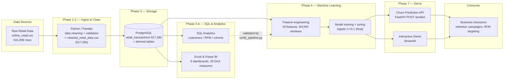

# System Architecture — Retail Analytics & Customer Intelligence Platform

The diagram below is written in **Mermaid** so it is fully editable and
reproducible. Render it on [mermaid.live](https://mermaid.live), in GitHub
markdown, or via VS Code's Markdown Preview.

## Data flow (high level)



## Component map

| Layer | Technology | Key outputs |
|---|---|---|
| Ingest & cleaning | Python 3, Pandas | `cleaned_retail_data.csv` (527,390 rows) |
| Storage | PostgreSQL 13+ | `retail_transactions`, `customers`, `rfm_segments`, `cohort_retention` |
| SQL analytics | SQL (psycopg2) | RFM segments (4,339), cohort retention (91) |
| BI / reporting | Excel, Power BI | 6 dashboards, 29 DAX measures (validated) |
| ML / churn | scikit-learn | final tuned logistic (C=0.1), W2 ROC-AUC 0.7332 |
| Serve | FastAPI, Streamlit | `POST /predict`, interactive demo |
| Quality gate | custom `validators.py` | PASS/WARNING/FAIL on every check |

## ASCII fallback

```
Raw Retail CSV (541,909)
        │  Phase 1-2: Python/Pandas cleaning + validation
        ▼
Cleaned CSV (527,390) ──► PostgreSQL (transactions + derived tables)
                              │  Phase 3-4: SQL analytics (RFM, cohorts)
                              ▼
                    SQL / Excel / Power BI (dashboards, 29 DAX measures)
                              │  Phase 6: feature engineering (18 feats)
                              ▼
                    ML churn model (logistic C=0.1, W2 ROC-AUC 0.7332)
                              │  Phase 7: serve
                              ▼
              Churn Prediction API ──► Interactive Demo (Streamlit)
                              │
                              ▼
                    Business Decisions (retention, RFM targeting)
```

_Note: every arrow in the diagram corresponds to code in this repository.
Re-run the full chain with `pipeline/run_pipeline.py` → `pipeline/run_ml.py` →
`pipeline/run_ml_tune.py`._
